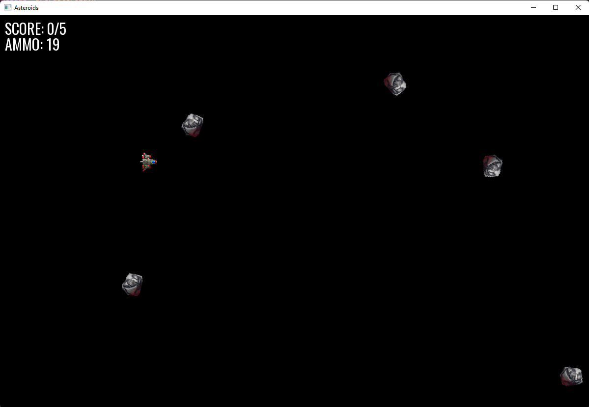

# Asteroids

## Setup
There is a wonderful video by <a href="https://www.youtube.com/watch?v=fcZFaiGFIMA&list=PLMZ_9w2XRxiYkf00joyT5_bKQ0AvnMLbl&index=2">Hopson</a> that explains how to get started with SFML and Codeblocks<br>
If you're like me, who wants to execute terminal commands instead, here you go:

0. I'm assuming you have a C++ compiler installed, preferably, the <a href="https://www.mingw-w64.org/downloads/">MinGW</a> one.
1. Follow `./lib/Instructions.md`
2. Copy-Paste the files present in `./lib/SFML/bin`, here:
```
- sfml-graphics-d-2.dll
- sfml-system-d-2.dll
- sfml-window-d-2.dll
```
3. Run the following codes in the exact same order
```sh
g++ -Wall -fexceptions -g -Ilib\SFML\include -c .\main.cpp -o .\main.o
```
```sh
g++ -Llib\SFML\lib -o .\Asteroids.exe .\main.o -lsfml-graphics-d -lsfml-window-d -lsfml-system-d
```
```sh
.\Asteroids.exe
```
4. Movement can be controlled via the arrow or WASD keys
5. Use spacebar to shoot
6. As always, some details can be tweaked in `config.h`
7. Sounds and Explosions to be added next
8. Images (except the screenshot below) are not mine

## Preview

