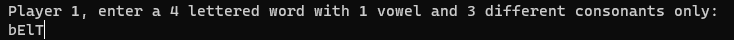
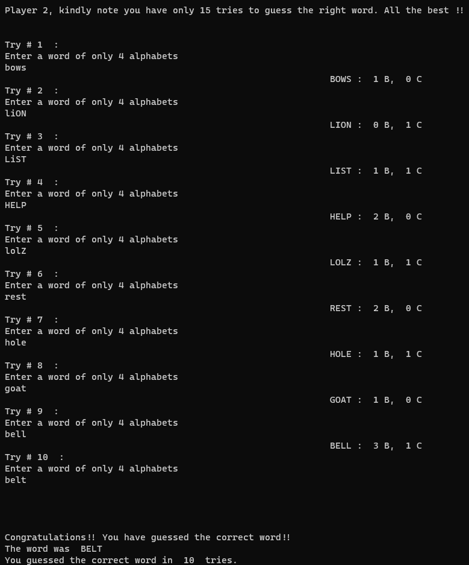

# Cow Bull

## Instructions
- This is a 2 player game.
- Player 1 choses a 4 letter word with a single vowel and no repititions.
- Player 2 has 15 tries to guess that word.
- To guess the word, player 2 should also enter a 4 letter word. (No restrictions here)
- If a letter of the trial word is on the same place as the original word, we call it a "BULL (B)".
- If a letter of the trial word exists on in the original word but is not at the right place, we call it a "COW (C)".
- Naturally, 4B means you guessed the word correctly.
- This is not a case sensitive game, i.e. you can enter your word in uppercase, lowercase or a mixture of both.

## How to play
- This game can be directly played in a terminal.
- Open up a terminal in the Cow-Bull directory.
- Type in the following command:
```sh
$ python3 Cow-Bull.py
```
- And... Start Guessing :)

## Examples




## Acknowledgement

I would like to thank Hitarth Goyal for helping me come up with this game.
Couldn't have been possible without you :)