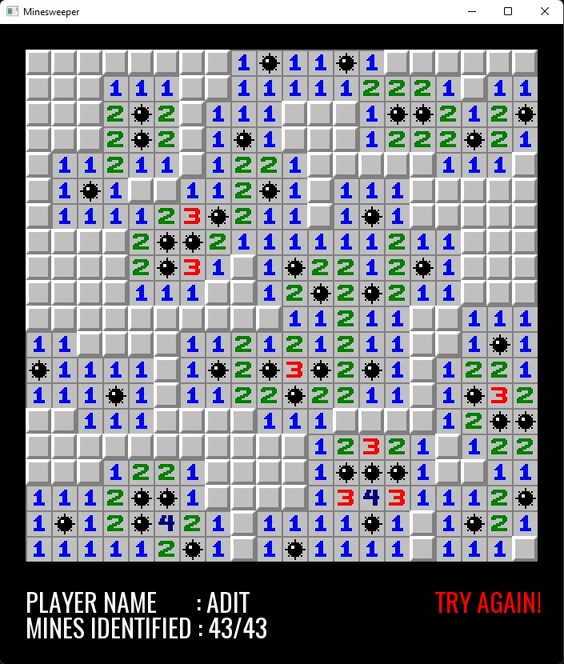

# Minesweeper

## Reasons:
Well, there are a few reasons as to why I wanted to build this game
- Was bored
- Wanted to go beyond the green circle tutorial by SFML
- Like C++ (probably more than python)
- Gaming is love
- <a href="https://jadit19.github.io/WebDev/Minesweeper/">Previously made Minesweeper game</a> still haunts me 💀

## Setup
There is a wonderful video by <a href="https://www.youtube.com/watch?v=fcZFaiGFIMA&list=PLMZ_9w2XRxiYkf00joyT5_bKQ0AvnMLbl&index=2">Hopson</a> that explains how to get started with SFML and Codeblocks<br>
If you're like me, who wants to execute terminal commands instead, here you go:

0. I'm assuming you have a C++ compiler installed, preferably, the <a href="https://www.mingw-w64.org/downloads/">MinGW</a> one.
1. Follow `./lib/Instructions.md`
2. Copy-Paste the files present in `./lib/SFML/bin`, here:
```
- sfml-graphics-d-2.dll
- sfml-system-d-2.dll
- sfml-window-d-2.dll
```
3. Run the following codes in the exact same order
```sh
g++ -Wall -fexceptions -g -Ilib\SFML\include -c .\main.cpp -o .\main.o
```
```sh
g++ -Llib\SFML\lib -o .\Minesweeper.exe .\main.o -lsfml-graphics-d -lsfml-window-d -lsfml-system-d
```
```sh
.\Minesweeper.exe
```
4. As always, some details can be tweaked in `config.h`

## General Info
- Code is unoptimized ¯\\\_(ツ)_/¯
- Might be buggy, do let me know (Removed all the bugs I could find..)
- Need help? Lemme know

## Preview
Yeah, I'll try again..

