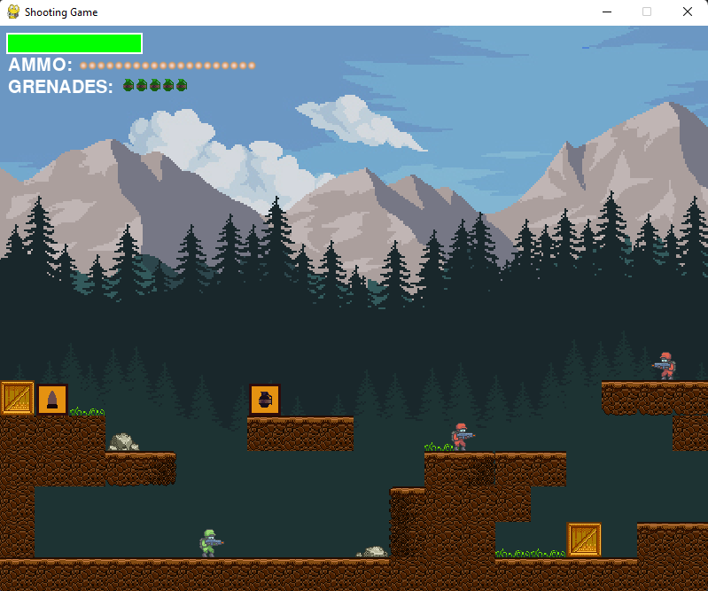

# 2D Shooting Game

I've tried to make a 2D shooting game, much like the ones you may find in an arcade.

In order to run this on your system, you have to install the pygame library on your system using the following command:

```sh
$ pip3 install pygame
```

## Instructions
- To launch this game, execute the following command in this directory:
```sh
$ python3 ./game.py
```
- Use the arrow keys or WASD for the player movement.
- Press space bar for shooting bullets.
- Press 'g' for throwing grenades.
- An Enemy can be killed with 4 bullets or 2 grenades.
- If you fall in water or fall into the abyss, you die. An option to `RESTART` the level will then appear on your screen.
- Use the `Esc` key to close the widow.
- You can customize your game using the variables defined in the `config.py` file.
- I have uploaded only a single level for trial. You can create your own as well:

## How to make a New Level
- To make a new level, execute the following command in this directory:
```sh
$ cd Level-Editor
$ python3 ./level-editor.py
```
- You can load in an existing level using the `LOAD` button.
- By default, the initial level is set to 0.
- Use the `UP` or `DOWN` arrow keys to change the number of the level to be made.
- Choose any of the tiles to place into the world map and left click on the map to insert it there.
- Right clicking on any tile will remove the tile from it's location.
- You can only add 1 green Soldier, a.k.a. the player. Having none or > 1 players might cause the game to crash.
- However, you can insert any number of red Soldier, a.k.a. the enemies.
- Make sure to add an `END` sign at the end of the map to let the player know that they've completed this level and can move on to the next one.
- Finally, don't forget to save the level. The levels are saved in the `./Levels` directory.
- You can submit your Pull-Request for your levels as well :)

## Gameplay


## Acknowledgement
A little bit of help was taken from <a target="_blank" href="https://www.youtube.com/channel/UCPrRY0S-VzekrJK7I7F4-Mg">HERE</a>.