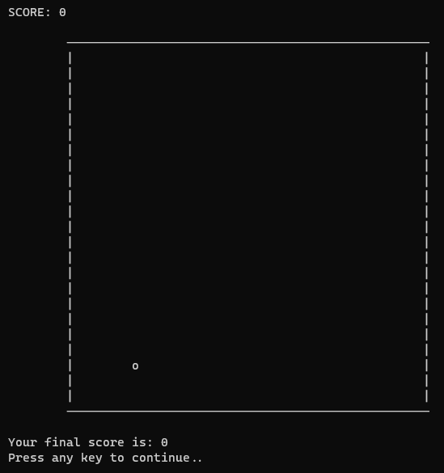

# Snake Game (C++ Version)

This is an attempt of mine to recreate the famous "SNAKE" game in C++ using the terminal as a canvas.

In order to run this on your system, you have to install a c++ compiler on your system. I've been using the <a href="https://sourceforge.net/projects/mingw/">MinGW Compiler</a>.

## Instructions
- To launch the game, execute the following commands in this directory:
```sh
$ g++ ./main.cpp
$ ./a.exe
```
- By default, if the snake hits the walls or it's body, the game will end.
- If you want to disable the walls to be an end-point for the game, go to `Snake.h` and make the following change on line #11:
```cpp
const bool isWallAnEnd = 0;
```
- By default, the snake head will be "0" and will be at the center of the square, waiting for your command.
- Snake body is represented by "*".
- Food is represented by "o".
- You can use the WASD or arrow keys for the snake's movement.

## Examples



As you can clearly see, I'm terrible at this game XD.