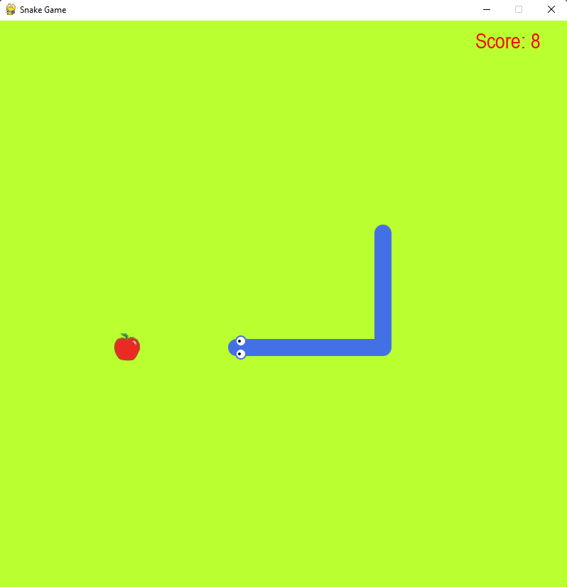
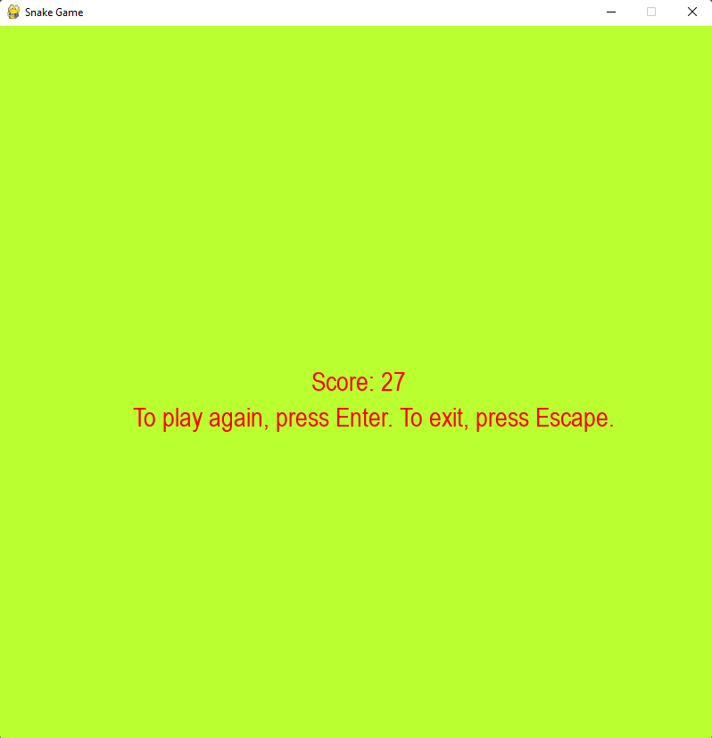

# Snake Game (Python Version)

This is an attempt of mine to recreate the famous "SNAKE" game in Python using the "pygame" library.

In order to run this on your system, you have to install the pygame library on your system using the following command:

```sh
$ pip3 install pygame
```

## Instructions
- To launch this game, execute the following command in this directory:
```sh
$ python3 ./game.py
```
- By default, if the snake hits the walls or it's body, the game will end.
- If you want to disable the walls to be an end-point for the game, go to `config.py` and make the following change on line #1:
```py
isWallAnEnd = False
```
- You can see various customization option there.. Try changing some and see what happens :)
- You can use the WASD or arrow keys for the snake's movement.

## Examples





As you can clearly see, irrespective of language, I'm terrible at this game XD.